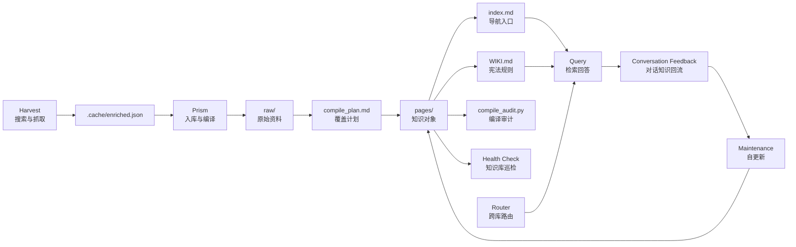

# Prism Knowledge System

Prism 是一个面向个人知识库的 **可审计 LLM Wiki 编译系统**。它把搜索、资料抓取、知识编译、质量审计、跨库路由、健康检查和持续维护组织成一套可运行的工作流，让个人知识不只是“被存下来”，而是能被持续导航、理解、追溯、验证和更新。

一句话概括：**Prism 不是把文档塞进向量库的 RAG，也不是让 LLM 做一次性总结，而是让每个主题知识库拥有自己的 `WIKI.md` 宪法，由 Agent 按覆盖清单、抽取表和审计规则，把原始资料编译成可维护、可追溯、可检查的 Markdown 知识网络。**

## Why

个人知识库常见的问题不是“没有资料”，而是资料越来越多以后：

- 找不到入口：笔记、网页、聊天记录和文档散落在不同位置。
- 难以维护：旧结论不会自动吸收新资料，页面容易过时。
- 不可追溯：回答看似合理，但很难知道依据来自哪里。
- 缺少治理：知识库有内容，不代表它健康、可导航、可信。
- 技术迭代太快：AI 时代的新工具、新模型、新实践每天都在变化，靠手动收藏、偶尔搜索和临时阅读，很难持续高效地收集高价值知识。
- LLM 总结不稳定：一次性总结容易压缩细节，遗漏实体、概念、边缘观点和关键证据。
- 缺少覆盖证明：很难判断哪些 raw 资料已经被真正吸收，哪些只是被标记为“处理过”。

Prism 的目标是把个人知识库从“文件堆”升级为“可自我维护、可审计的 LLM Wiki”。

## What Makes Prism Different

Prism 的核心价值不只是“让 Agent 整理资料”，而是把知识整理变成一个有中间产物、有质量门槛、有审计结果的编译过程。

- **Constitution-driven**：每个知识库都有自己的 `WIKI.md`，定义该库如何编译、查询、维护和巡检。
- **Harvest-to-wiki pipeline**：通过 `harvest` 持续搜索、过滤、抓取和富化资料，把快速变化的外部信息转化为可入库 raw records。
- **Raw coverage first**：编译前生成 `compile_plan.md`，列出本轮所有待吸收 raw 资料。
- **Extraction table**：编译中要求显式记录实体、概念、判断、事实和目标页面，避免只做全文摘要。
- **Auditable compile**：编译后运行 `compile_audit.py`，检查 compiled raw 是否被页面引用，高权重 raw 是否进入 overview。
- **Cross-wiki routing**：当知识库增长到多个主题时，`router` 会先做语义扩展，再用本地 BM25 选择相关知识库，并支持跨库对比与整合。
- **Markdown-native**：所有知识对象都是普通 Markdown 文件，可被 Git、VS Code、Obsidian 和任何文本工具直接管理。

## Core Idea

Prism 采用三层心智模型：

- `raw/`：原始资料层。保存抓取文章、内部文档、手动加入的材料。
- `pages/`：知识对象层。由 Agent 编译出的 `overview`、`concepts`、`entities`、`syntheses`。
- `WIKI.md`：知识库宪法层。定义该知识库如何编译、查询、维护和健康检查。

在这三层之上，Prism 增加了编译治理机制：

- `compile_plan.md`：本轮编译的 raw 覆盖清单、抽取表和高权重 overview 覆盖清单。
- `compile_audit.py`：编译后的机器审计脚本，检查引用覆盖和 overview 覆盖。
- `index.md` / `log.md`：知识消费入口与操作历史。

每个主题都是一个独立知识库，每个知识库都能沉淀自己的术语、偏好、历史判断、引用链和质量记录。



## Three Skills

### Harvest

`harvest` 负责发现和抓取资料。

- 支持 Bing、Hacker News、GitHub、YouTube，以及 Bilibili、微博、掘金等中文源。
- 通过 AI 标注做价值过滤，剔除低相关、低质量内容。
- 使用 Python 下载网页 HTML，再交给 Node + Defuddle 在本地解析正文。
- 将“今天发生了什么”这类开放搜索，转化为可追踪、可过滤、可编译的本地数据资产。
- 输出统一的 `[topic]/.cache/enriched.json`，供 Prism 入库。

### Prism

`prism` 负责把原始资料编译成 LLM Wiki。

- 将抓取结果保存到 `wiki/raw/` 和 `wiki/signals/`。
- 生成 `compile_plan.md`，建立 raw 覆盖清单和 Extraction Table。
- 根据 `WIKI.md` 识别实体、概念、综合判断和 overview 页面。
- 运行 `compile_audit.py`，检查已编译 raw 是否被页面引用，高权重资料是否进入 overview。
- 维护 `index.md`，让知识库保持可导航。
- 支持 Query、Maintenance / Self-update、Health Check 等知识库操作模式。

### Router

`router` 负责在多个知识库之间选择正确上下文。

- 扫描工作区内的多个 `wiki/WIKI.md`。
- 生成本地 BM25 语料，不依赖外部数据库或服务。
- 由宿主 Agent 先做语义扩展，再用脚本做本地路由。
- 命中单库时进入对应知识库，多库命中时并行检索多个 Wiki，并按主题、结论和分歧进行跨库整合。

## LLM Wiki Modes

每个新建知识库都会从模板获得自己的操作模式。

| Mode | Purpose |
| --- | --- |
| `Compile` | 将未编译的 `raw/` 资料转化为结构化知识对象。 |
| `Query` | 按 `index -> overview -> concepts/entities/syntheses -> raw` 路径检索回答。 |
| `Maintenance / Self-update` | 吸收新增资料、内部文档和已确认的高价值问答。 |
| `Health Check` | 检查知识库是否仍然可导航、可理解、可信、可维护。 |

Query 模式特别面向个人知识库：它优先使用知识库中已经沉淀的术语、偏好、历史判断和实践经验，而不是把问题泛化成百科式回答。

## Compile Quality Gates

Prism 的 Compile 模式不是“直接让 LLM 写页面”。每轮编译都经过三个质量门禁：

1. **Raw Coverage Plan**：`compile_plan.py` 扫描 `raw/_index.json`，生成待编译 raw 清单，并按 importance / relevance 排序。
2. **Extraction Table**：Agent 编译时必须把每个 raw 中可复用的实体、概念、判断、数据点写入 `compile_plan.md`，并标注目标页面。
3. **Compile Audit**：`compile_audit.py` 检查：
   - 已标记 `compiled: true` 的 raw 是否至少被一个页面引用。
   - `urgent` / `high` / relevance >= 80 的 raw 是否进入至少一个 overview 页面。
   - 哪些页面缺少 raw citation，需要后续补强。

这套机制的目的，是把 LLM 的知识整理从“看起来写完了”变成“可以检查哪些资料真的被吸收了”。

## Technical Highlights

- **Agentic skill workflow**：Harvest、Prism、Router 三个 skill 组成端到端知识流水线。
- **Local full-text extraction**：使用 Node.js + Defuddle 解析网页正文，降低对外部解析服务的依赖。
- **AI-assisted value filtering**：搜索结果先经过真实性、相关性、重要性和摘要标注，再进入抓取与入库。
- **Fast knowledge intake**：Harvest 将快速变化的技术动态转化为统一的 `enriched.json` 和后续 raw records。
- **Manual document normalization**：支持 `.md`、`.pdf`、`.docx`、`.pptx`、`.xlsx`、`.xls`、`.csv` 进入 `raw/`。
- **Auditable Markdown compiler**：通过 `compile_plan.md` 和 `compile_audit.py` 给 LLM 编译增加可验证中间层。
- **Local BM25 routing**：Router 使用本地 BM25，并结合中文 character bigram 与英文 token 分词。
- **Agent semantic expansion**：BM25 打分前由宿主 Agent 扩展用户问题，补充同义词、专有名词和领域术语。
- **Cross-wiki synthesis**：Router 可以在多个主题知识库之间收集答案，并合并共识、差异和来源。

## Quick Start

Prism 作为一组 Agent skills 使用。建议在一个独立 workspace 中管理知识库。

```bash
mkdir ~/knowledge
cd ~/knowledge
```

### 1. Harvest a topic

对 Agent 说：

```text
使用 harvest 技能，帮我搜索并抓取今天关于 Claude Code 的最新新闻。
```

预期产物：

```text
claude_code/
  .cache/
    search_results_raw.json
    annotations.json
    annotated_results.json
    enriched.json
```

### 2. Compile into an LLM Wiki

对 Agent 说：

```text
使用 prism 技能，把刚刚获取到的 Claude Code 数据整理到知识库中。
```

预期产物：

```text
claude_code/
  wiki/
    WIKI.md
    compile_plan.md
    index.md
    log.md
    raw/
    signals/
    pages/
      overview/
      concepts/
      entities/
      syntheses/
```

### Manual raw upload

You can also put local files directly into a knowledge base's `wiki/raw/` directory before running `prism`.

Supported manual inputs:

- `.md`
- `.pdf`
- `.docx`
- `.pptx`
- `.xlsx`
- `.xls`
- `.csv`

When `prism` runs, it first normalizes manually uploaded files into standard raw records and registers them in `raw/_index.json`. These records are marked `compiled: false`, so the normal Compile flow can pick them up.

### 3. Query a single knowledge base

进入某个主题知识库后直接提问即可，不需要额外调用 skill。

```bash
cd ~/knowledge/claude_code/wiki
```

对 Agent 说：

```text
Claude Code 最近的能力变化，对个人开发者有什么影响？
```

Agent 会按该知识库的 `WIKI.md` 执行 Query 模式，优先从 `index.md`、`overview`、相关实体和综合页中回答，并在需要时追溯到 `raw/`。

### 4. Query across knowledge bases

在 workspace 根目录使用 `router`。

```bash
cd ~/knowledge
```

对 Agent 说：

```text
使用 router 技能，对比 Codex 和 Claude Code 在自动化编程上的差异。
```

Router 会先发现多个知识库，再将问题路由到最相关的 LLM Wiki。

## How It Differs From Typical RAG

| Typical RAG | Prism LLM Wiki |
| --- | --- |
| 以向量检索为中心 | 以可维护的 Markdown 知识对象为中心 |
| 回答时临时拼接上下文 | 先编译知识，再基于知识网络回答 |
| 依赖用户手动找资料 | Harvest 自动搜索、过滤、抓取并沉淀新资料 |
| 难以判断知识库是否健康 | 内置 Health Check 检查结构、内容、时效、追溯和消费路径 |
| 原始资料和结论关系不透明 | 强制使用 `[[Page]] -> [[raw/...]]` 的来源链 |
| 很难证明资料是否被吸收 | 使用 Raw Coverage Checklist 和 Extraction Table 检查吸收过程 |
| LLM 输出质量主要靠 prompt | 编译后运行 audit，检查 raw citation 和高权重 overview 覆盖 |
| 多主题知识容易割裂 | Router 支持跨库路由、并行查询、共识合并和分歧标注 |
| 更像问答系统 | 更像个人知识资产操作系统 |

## Repository Layout

```text
.
├── skills/
│   ├── harvest/
│   ├── prism/
│   └── router/
├── HANDOFF.md
└── README.md
```

## Current Status

Prism 当前提供一套完整的 Agentic knowledge workflow，核心能力包括：

- 多源搜索与抓取。
- 本地 HTML 下载与 Defuddle 正文解析。
- 面向快速技术迭代的 Harvest 知识收集入口。
- 原始资料入库、元数据索引和增量扫描。
- 手动文档归一化与 raw 注册。
- LLM Wiki 初始化模板。
- 编译前 Raw Coverage Checklist。
- 编译中 Extraction Table。
- 编译后 raw citation audit 与高权重 overview coverage gate。
- Query、Maintenance / Self-update、Health Check 操作协议。
- 多知识库发现、本地 BM25 路由与跨库知识整合。

## Development & Tests

Prism 的核心脚本使用 Python / Node.js 实现，测试集中在 Prism 入库、手动文档归一化和编译质量门禁。

```bash
python -m unittest discover -s skills/prism/scripts -p 'test_*.py'
python -m unittest discover -s skills-internal/prism/scripts -p 'test_*.py'
```

## Philosophy

Prism 的核心信念是：**知识不是一次性检索结果，而是可以被长期维护的个人认知资产。**

Everything is a Markdown file. Every knowledge base has a constitution. Every answer should be navigable, understandable, trustworthy, and maintainable.
